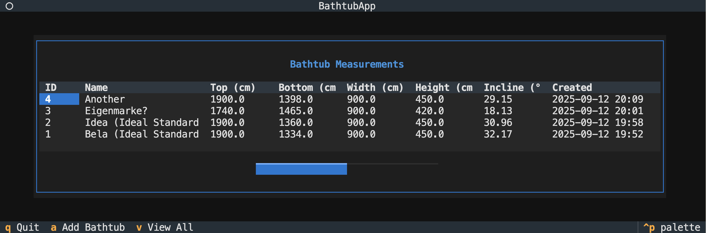

# Bathtub Inclines

It's hard to get information about inclines. Here's a text-based app to record and view inclines:

## Setup

Clone the project. Run it with `uv run bathe.py`.

If you don't use uv, first create a venv and install `textual`, then run with `python bathe.py`.

## Caveats

Current measurements are inaccurate because of the bathtub edge and because the bottom measurements seem not to be all the way at the bottom (?). You can check out some schemas in `schemas/`.

Also, this is entirely vibe-coded and I haven't checked the code at all, so the calculations might be wrong 😅
